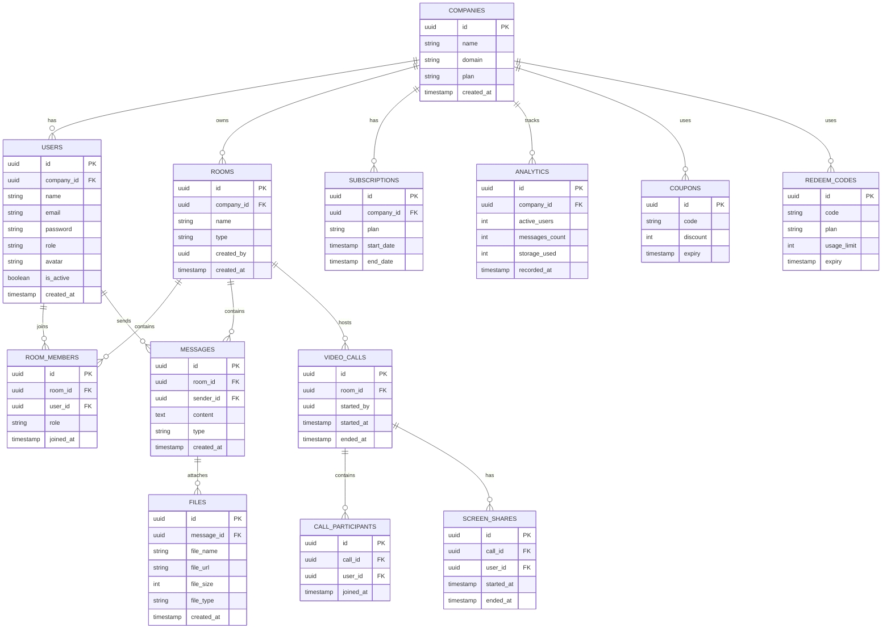

# Database ER Diagram
## Liquid Glass Collaboration Platform

---

# Overview

This database is designed for a multi-tenant collaboration platform supporting:

- Multi-company workspaces
- Real-time messaging
- Video calling
- Screen sharing
- File sharing
- Subscription system
- Admin roles
- Analytics

---

# Main ER Diagram

---

# Multi Tenant Structure

Each Company has:

- Users
- Rooms
- Messages
- Analytics
- Subscription

Data Isolation handled by:

company_id

---

# Role System

Roles Supported:

- Master Admin
- Company Admin
- Moderator
- User

---

# Message Types

Supported Message Types:

- text
- image
- file
- code
- video
- audio
- system

---

# Room Types

Supported Room Types:

- Direct Message
- Group Chat
- Channel

---

# File Storage Types

Storage Methods:

- Server Upload (Small Files)
- P2P WebRTC (Large Files)

---

# Performance Indexing

Recommended Indexes:

USERS
- company_id
- email

MESSAGES
- room_id
- created_at

ROOM_MEMBERS
- user_id
- room_id

FILES
- message_id

VIDEO_CALLS
- room_id

---

# Future Extensions

Possible Future Tables:

- Notifications
- AI Messages
- Audit Logs
- Activity Logs

---

# Final Notes

This ER design supports:

- Multi Company
- Real time chat
- Video calling
- Screen sharing
- File sharing
- Analytics
- Subscription system

This schema is scalable for 5000+ users.

---

End of Database ER Diagram
