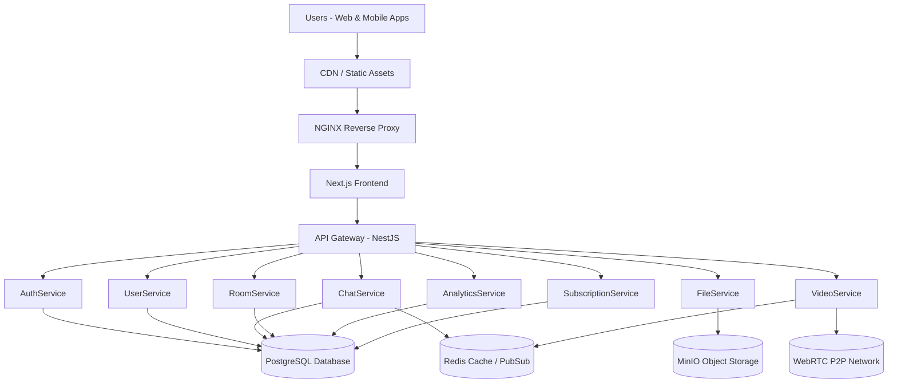
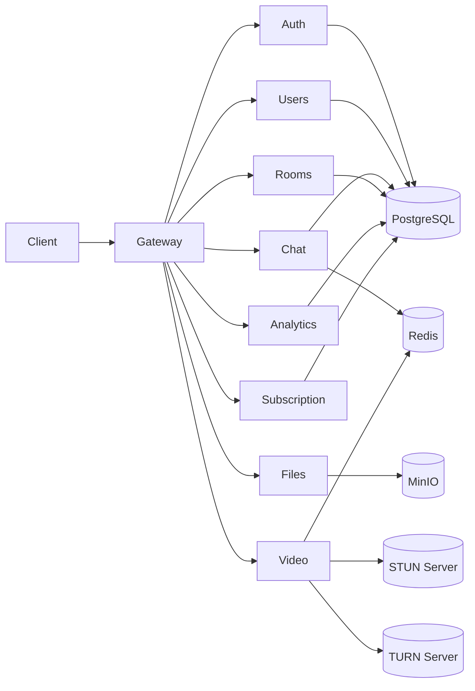
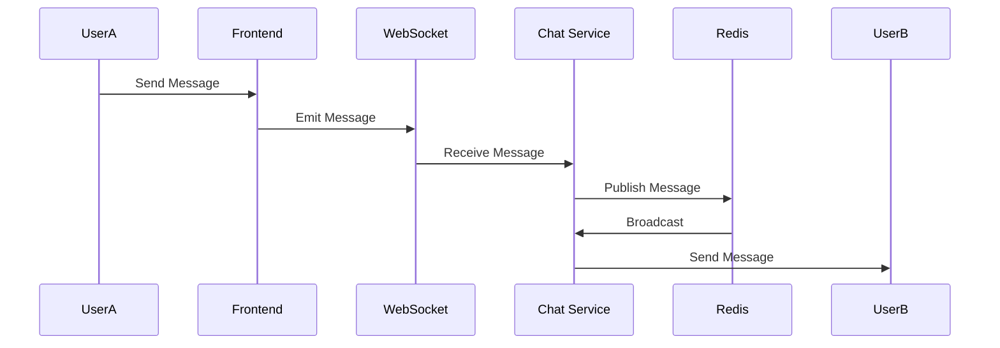
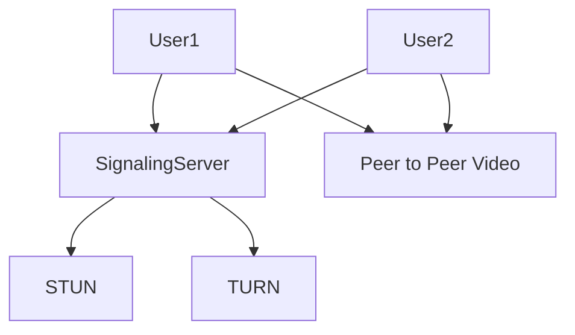
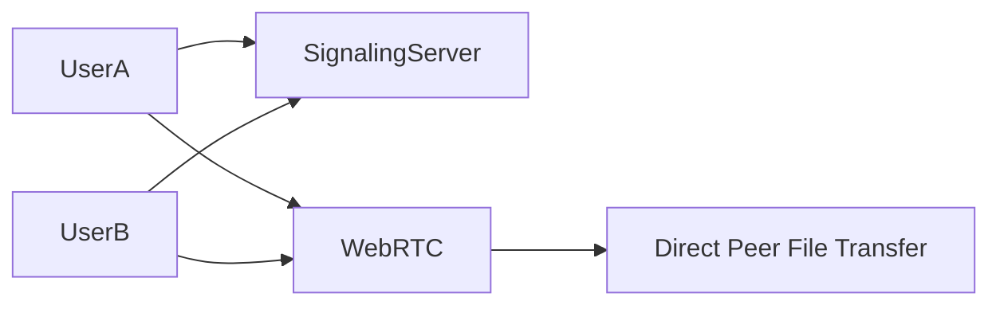
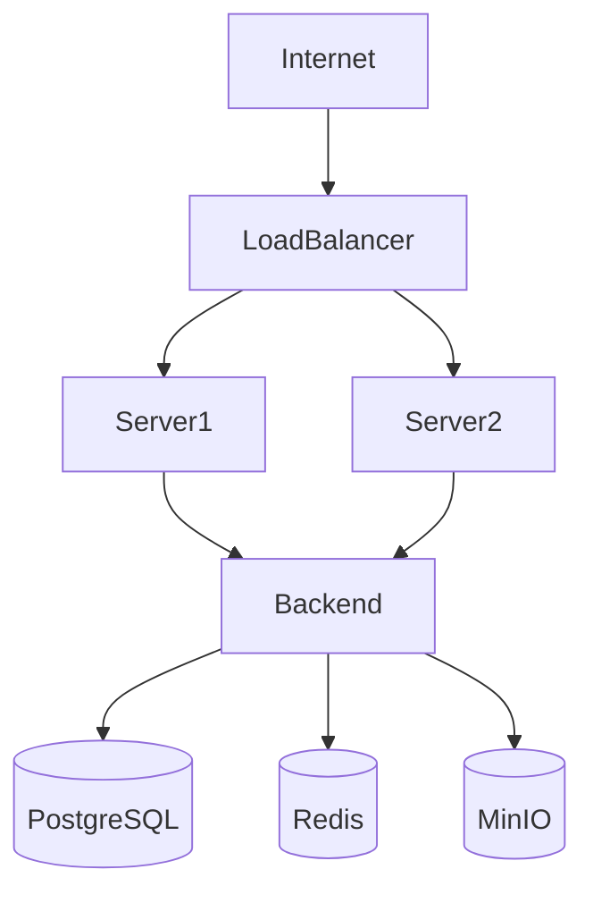
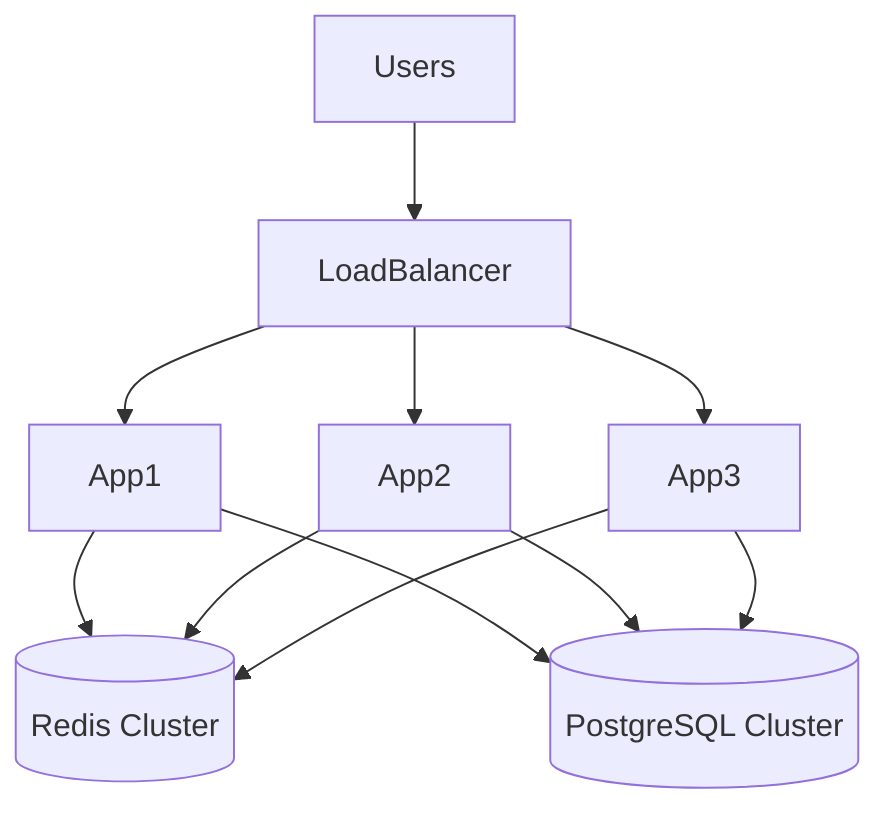

# System Architecture Diagram
## Liquid Glass Collaboration Platform

---

# High Level Architecture

---

# Detailed Microservices Architecture

---

# Realtime Messaging Architecture

---

# Video Calling Architecture

---

# Large File P2P Sharing

---

# Deployment Architecture

---

# Recommended Server Setup (5000 Users)

Primary Server

- 8 CPU
- 16GB RAM
- 200GB SSD

Services:

- NGINX
- Backend
- Redis
- PostgreSQL
- MinIO

---

# Future Scaling Architecture

---

# Final Architecture Summary

Frontend

- Next.js
- React

Backend

- NestJS
- Node.js

Database

- PostgreSQL

Realtime

- WebSocket
- Redis

Video Calling

- WebRTC

File Storage

- MinIO

Deployment

- Docker
- Nginx

---

End of Architecture Document

